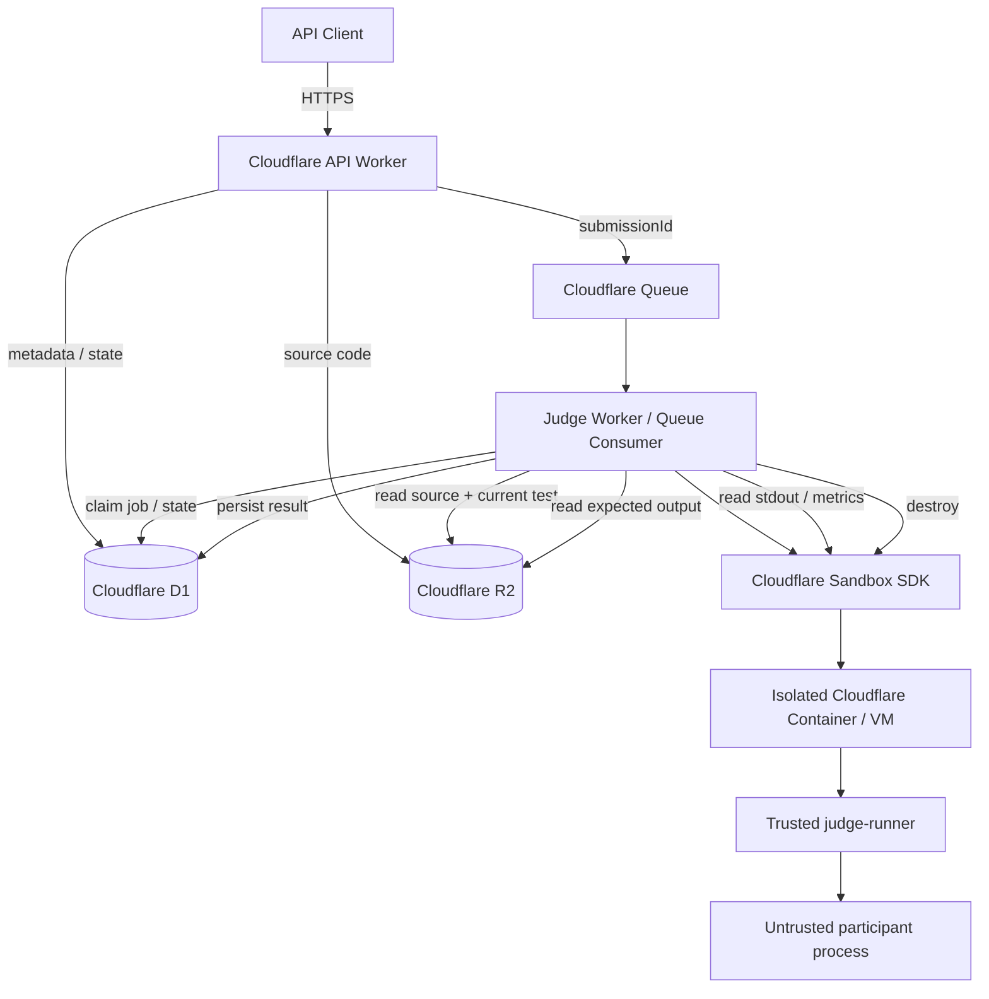
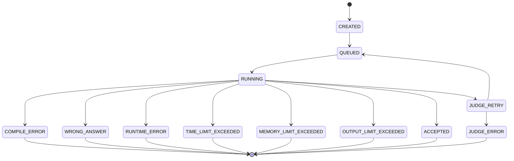

# Remote Runtime Environment — Backend Architecture

## 1. Purpose

This document defines the backend architecture for **Task 2 — Remote Runtime Environment** for the GDG VIT Chennai speed-coding event.

The system is backend-only. It does not include a participant-facing web interface. Clients interact with the platform through HTTP APIs.

The system must accept participant source code, compile it where required, execute it in an isolated environment, check correctness, measure efficiency, survive hostile or broken programs, and return deterministic judgments as far as reasonably possible on shared cloud infrastructure.

The implementation is designed around Cloudflare:

- **Cloudflare Workers** — public API and trusted orchestration
- **Cloudflare Queues** — asynchronous submission scheduling and retry
- **Cloudflare Sandbox SDK / Containers** — isolated Linux execution environments
- **Cloudflare D1** — relational metadata, state, results, rankings, audit records
- **Cloudflare R2** — source files, hidden test data, expected outputs, optional logs/artifacts
- **Durable Objects** — used indirectly by the Sandbox SDK / Containers lifecycle; no custom Durable Object application logic is required for the core design

No frontend, Redis, PostgreSQL, Kubernetes, external VM, external message broker, KV, or separate execution provider is required for the planned version.

---

## 2. Task Requirements Mapped to Architecture

The supplied Task 2 brief requires a remote runtime environment in which participant code is compiled and run, efficiency is compared, execution is deterministic, and disruptions such as process preemption, memory leaks, infinite loops, and memory overflow are handled.

The architecture maps those requirements as follows.

| Requirement | Architectural response |
|---|---|
| Remote code execution | Cloudflare Sandbox SDK / Containers |
| Compile submitted code | Fixed compiler inside pinned sandbox image |
| Execute submitted code | Trusted `judge-runner` launches untrusted executable |
| Optional multi-language support | Trusted adapters support C++17, C17, Python 3, and JavaScript |
| Algorithmic efficiency | CPU time, wall time, and peak memory are collected |
| Deterministic judgment | Pinned environment, versioned tests, fixed limits, no Internet, repeated benchmark runs |
| Process preemption | Queue retries + D1 execution lease + idempotent state transitions |
| Infinite loops | CPU limit + wall timeout + process termination |
| Memory overflow | Per-submission memory limit enforced by trusted runner |
| Memory leak | One disposable sandbox per submission; sandbox destroyed after judging |
| Fork/process explosion | Process count restriction + process-group termination |
| Huge output | Bounded stdout/stderr |
| Infrastructure failure | Retryable judge errors, bounded retry count, DLQ |
| Scalability | Queue-based backpressure and fixed consumer/container concurrency |
| Cost control | Ten concurrent judges initially; queue absorbs bursts |
| Reproducibility | Pinned container image, compiler version, problem/test version, migrations, Wrangler config |
| Security | Strict trust boundary; sandbox receives no D1/R2 credentials, secrets, or expected answers |

---

## 3. High-Level Architecture



### Core design principle

The **Worker side is trusted**.

The **participant sandbox is untrusted**.

Participant code never receives a D1 binding, an R2 binding, a Cloudflare token, API secrets, participant credentials, expected outputs, other participants' files, or any infrastructure credential.

---

## 4. Trust Boundaries

```text
┌────────────────────────────── TRUSTED ──────────────────────────────┐
│                                                                     │
│ API Worker                                                          │
│ Judge Worker                                                        │
│ Queue                                                               │
│ D1                                                                  │
│ R2                                                                  │
│ Problem metadata                                                    │
│ Hidden expected outputs                                             │
│ Authentication logic                                                │
│ Ranking logic                                                       │
│                                                                     │
└───────────────────────────────┬─────────────────────────────────────┘
                                │
                                │ source + one input + limits only
                                ▼
┌───────────────────────────── UNTRUSTED ─────────────────────────────┐
│                                                                     │
│ Fresh Sandbox / Container                                           │
│                                                                     │
│  ┌──────────────────── trusted-inside-sandbox ───────────────────┐  │
│  │ judge-runner                                                  │  │
│  │ - launches participant program                                │  │
│  │ - enforces execution limits                                  │  │
│  │ - measures resources                                         │  │
│  │ - kills entire process group                                 │  │
│  └──────────────────────────────┬─────────────────────────────────┘  │
│                                 ▼                                   │
│                    participant executable                           │
│                                                                     │
│ No D1 binding                                                       │
│ No R2 binding                                                       │
│ No secrets                                                          │
│ No public Internet                                                  │
│ No expected outputs                                                 │
│ Disposable filesystem                                               │
│                                                                     │
└─────────────────────────────────────────────────────────────────────┘
```

The sandbox is treated as compromised from the moment participant code starts.

That assumption is important. Security does not depend on the participant process behaving correctly.

---

## 5. Cloudflare Sandbox SDK Instead of a General Container Service

The execution layer should use the **Cloudflare Sandbox SDK on top of Containers**, rather than writing a general HTTP server inside a raw Container and exposing it as a runner.

The Sandbox SDK is specifically intended for isolated code execution from Workers and provides:

- isolated filesystems
- process execution
- process handles
- process termination
- lifecycle management
- container cleanup
- explicit sandbox identities
- outbound network controls
- VM-backed isolation through Cloudflare Containers

Cloudflare currently recommends the Sandbox SDK 1.0 preview for new projects. The implementation should pin an exact package version rather than follow an unbounded `latest` dependency.

Example design:

```text
Worker
  │
  └── getSandbox(env.Sandbox, sandboxId)
           │
           └── Cloudflare-managed container instance
```

The sandbox ID should map to the execution attempt, for example:

```text
submission-{submissionId}-attempt-{attemptNumber}
```

This gives each attempt an independent lifecycle.

---

## 6. Container / Sandbox Sizing

For algorithm benchmarking, fractional CPU environments are undesirable because CPU contention becomes a larger source of noise.

Cloudflare currently provides predefined instance sizes including:

| Instance | vCPU | Memory | Disk |
|---|---:|---:|---:|
| `lite` | 1/16 | 256 MiB | 2 GB |
| `basic` | 1/4 | 1 GiB | 4 GB |
| `standard-1` | 1/2 | 4 GiB | 8 GB |
| `standard-2` | 1 | 6 GiB | 12 GB |
| `standard-3` | 2 | 8 GiB | 16 GB |
| `standard-4` | 4 | 12 GiB | 20 GB |

### Planned execution instance

Use:

```text
instance_type = standard-2
vCPU          = 1
sandbox RAM   = 6 GiB
sandbox disk  = 12 GB
```

The participant does **not** receive a 6 GiB problem memory limit. The 6 GiB value is the outer Cloudflare sandbox allocation. The trusted `judge-runner` enforces the much smaller contest memory limit, for example 256 MiB.

Reasons for `standard-2`:

1. one full vCPU makes performance measurements more meaningful than fractional-vCPU instance types;
2. sufficient memory exists for compilation while still applying a lower participant process limit;
3. one-vCPU execution reduces the variability caused by participant programs scaling across different core counts;
4. the system does not need `standard-3` or `standard-4` for normal algorithmic judging.

Cloudflare account-level Container limits are much larger than the event needs, so the contest intentionally limits concurrency rather than trying to use the account maximum.

---

## 7. Container Placement

Container placement should be constrained to:

```text
APAC
```

because the event is operated from India and because restricting the placement region reduces unnecessary geographic variability.

Important distinction:

```text
same Cloudflare region != guaranteed same physical CPU model
```

APAC placement improves consistency, but does not create perfectly identical hardware.

Cold-start duration and Worker-to-Container latency are never included in participant performance scoring.

---

## 8. Concurrency Model

### Planned concurrency

Use:

```text
Queue max_concurrency = 10
Sandbox/Container max_instances ≈ 10
Queue batch size = 1
```

The exact Container application configuration should match the Queue concurrency so that a burst cannot create more running submissions than intended.

### Why ten?

Ten is a deliberate event-level policy, not a Cloudflare platform maximum.

Example:

```text
800 queued submissions
      │
      ├── 10 executing
      └── 790 waiting safely in Cloudflare Queues
```

This provides:

- predictable compute usage
- predictable cost
- backpressure
- reduced risk of resource saturation
- easy-to-explain scaling
- the ability to increase the cap later

### Queue scalability

Cloudflare Queues can scale consumer invocations automatically and currently supports much more than ten concurrent consumer invocations. We intentionally cap the judge consumer at ten.

---

## 9. Queue Configuration

Recommended initial values:

```text
max_batch_size = 1
max_concurrency = 10
max_retries = 3
dead_letter_queue = judge-dlq
```

### Why batch size 1?

One queue message should represent one judging attempt:

```text
1 Queue message
      =
1 submission
      =
1 judging orchestration
      =
1 sandbox
```

This makes acknowledgment, retry, state transitions, logging, cleanup, and failure diagnosis much simpler.

### Queue payload

Only enqueue an identifier and minimal routing metadata:

```json
{
  "submissionId": "sub_01J..."
}
```

Do not enqueue:

- source code
- test data
- expected outputs
- secrets
- compiler logs

Cloudflare Queues has a message size limit, and large job payloads also make retries and state management less clean.

---

## 10. At-Least-Once Delivery and Idempotency

Cloudflare Queues provides **at-least-once delivery**.

Therefore a message can occasionally be delivered more than once.

The judge must never assume:

```text
one queue message == exactly one invocation
```

Instead:

```text
one logical submission == one authoritative final result
```

D1 is the authority for whether execution should proceed.

### Example duplicate delivery

```text
Queue delivers submission S
        │
        ▼
Worker A executes S
        │
        ▼
result written to D1
        │
        X Worker A dies before queue ACK
        │
        ▼
Queue redelivers S
        │
        ▼
Worker B checks D1
        │
        └── already terminal -> ACK without rerunning
```

This is the expected design, not an edge case.

---

## 11. Submission Claim / Execution Lease

A queue consumer should atomically claim a submission before starting a sandbox.

Conceptually:

```sql
UPDATE submissions
SET
    status = 'RUNNING',
    execution_token = ?,
    lease_until = ?,
    attempt_count = attempt_count + 1,
    started_at = COALESCE(started_at, CURRENT_TIMESTAMP),
    updated_at = CURRENT_TIMESTAMP
WHERE id = ?
  AND (
      status = 'QUEUED'
      OR (
          status = 'RUNNING'
          AND lease_until < CURRENT_TIMESTAMP
      )
  );
```

The worker proceeds only if its state transition succeeds.

### Why a lease?

A Worker can disappear after setting `RUNNING`.

Without a lease:

```text
submission = RUNNING forever
```

With a lease:

```text
RUNNING + expired lease
        ↓
safe to reclaim after queue redelivery
```

The lease duration must exceed a normal judging attempt and can be extended only if the implementation truly requires it.

Because Queue consumer invocations have a 15-minute wall-clock duration limit, judging should be designed to finish well before 15 minutes.

---

## 12. Execution State Machine



Possible terminal statuses:

- `COMPILE_ERROR`
- `WRONG_ANSWER`
- `RUNTIME_ERROR`
- `TIME_LIMIT_EXCEEDED`
- `MEMORY_LIMIT_EXCEEDED`
- `OUTPUT_LIMIT_EXCEEDED`
- `ACCEPTED`
- `JUDGE_ERROR`

Infrastructure failures must not be reported as participant runtime errors.

---

## 13. API Worker Responsibilities

The public API Worker owns:

- authentication
- authorization
- input validation
- source-size validation
- language validation
- problem lookup
- submission ID generation
- source upload to R2
- submission metadata insertion into D1
- Queue publication
- submission result APIs
- leaderboard APIs
- administrative problem/test APIs
- rate limiting logic if implemented

The API Worker never executes participant binaries.

### Submission creation flow

```text
POST /api/v1/submissions
        │
        ▼
authenticate
        │
validate problem/language/source
        │
generate submission ID
        │
source -> R2
        │
metadata -> D1
        │
submissionId -> Queue
        │
return HTTP 202
```

The API responds quickly instead of holding the HTTP connection while compilation and execution occur.

---

## 14. Judge Worker Responsibilities

The Queue consumer / Judge Worker owns the trusted orchestration:

1. receive `submissionId`;
2. read submission row;
3. skip terminal submissions;
4. acquire execution lease;
5. read source from R2;
6. read problem/test metadata from D1;
7. create fresh Sandbox;
8. copy source into sandbox;
9. compile once;
10. execute correctness cases;
11. compare outputs outside the sandbox;
12. if fully correct, execute benchmark cases;
13. collect trusted metrics;
14. calculate score;
15. destroy sandbox;
16. commit terminal result to D1;
17. acknowledge Queue message.

Expected outputs never need to enter the sandbox.

---

## 15. R2 Storage Architecture

R2 stores files that should not live as relational rows.

Recommended key layout:

```text
submissions/
  {submissionId}/
    source.cpp

problems/
  {problemId}/
    {problemVersion}/
      tests/
        001.in
        001.out
        002.in
        002.out
      benchmarks/
        001.in
        001.out
        002.in
        002.out
        003.in
        003.out

judge-artifacts/
  {submissionId}/
    {attempt}/
      compile.log
      stderr.log
```

The `judge-artifacts` area is optional.

### Why version problem data?

Never overwrite hidden data in place.

Bad:

```text
problems/two-sum/tests/001.in
```

Better:

```text
problems/two-sum/v3/tests/001.in
```

A submission stores the version used for judging.

Historical judgments then remain reproducible even after organizers revise a problem.

---

## 16. D1 Storage Architecture

D1 stores structured relational data.

Recommended entities:

- participants
- api_tokens
- problems
- problem_versions
- test_cases
- submissions
- submission_test_results
- submission_benchmarks
- judge_attempts

### Example schema

```sql
CREATE TABLE participants (
    id TEXT PRIMARY KEY,
    display_name TEXT NOT NULL,
    status TEXT NOT NULL DEFAULT 'ACTIVE',
    created_at TEXT NOT NULL
);

CREATE TABLE api_tokens (
    id TEXT PRIMARY KEY,
    participant_id TEXT,
    token_hash TEXT NOT NULL UNIQUE,
    role TEXT NOT NULL CHECK (role IN ('PARTICIPANT', 'ADMIN')),
    revoked_at TEXT,
    created_at TEXT NOT NULL,
    FOREIGN KEY (participant_id) REFERENCES participants(id)
);

CREATE TABLE problems (
    id TEXT PRIMARY KEY,
    slug TEXT NOT NULL UNIQUE,
    title TEXT NOT NULL,
    active_version INTEGER NOT NULL,
    time_limit_ms INTEGER NOT NULL,
    memory_limit_kb INTEGER NOT NULL,
    output_limit_bytes INTEGER NOT NULL,
    created_at TEXT NOT NULL,
    updated_at TEXT NOT NULL
);

CREATE TABLE problem_versions (
    problem_id TEXT NOT NULL,
    version INTEGER NOT NULL,
    language_policy TEXT NOT NULL,
    compiler_image_version TEXT NOT NULL,
    created_at TEXT NOT NULL,
    PRIMARY KEY (problem_id, version),
    FOREIGN KEY (problem_id) REFERENCES problems(id)
);

CREATE TABLE test_cases (
    id TEXT PRIMARY KEY,
    problem_id TEXT NOT NULL,
    problem_version INTEGER NOT NULL,
    kind TEXT NOT NULL CHECK (kind IN ('CORRECTNESS', 'BENCHMARK')),
    ordinal INTEGER NOT NULL,
    input_r2_key TEXT NOT NULL,
    expected_r2_key TEXT NOT NULL,
    comparator TEXT NOT NULL,
    weight REAL NOT NULL DEFAULT 1,
    FOREIGN KEY (problem_id, problem_version)
      REFERENCES problem_versions(problem_id, version)
);

CREATE TABLE submissions (
    id TEXT PRIMARY KEY,
    participant_id TEXT NOT NULL,
    problem_id TEXT NOT NULL,
    problem_version INTEGER NOT NULL,
    language TEXT NOT NULL,
    source_r2_key TEXT NOT NULL,

    status TEXT NOT NULL,
    attempt_count INTEGER NOT NULL DEFAULT 0,

    execution_token TEXT,
    lease_until TEXT,

    compiler_version TEXT,
    compiler_flags TEXT,
    runner_image_version TEXT,

    passed_tests INTEGER,
    total_tests INTEGER,

    performance_score_ns INTEGER,
    peak_memory_kb INTEGER,

    created_at TEXT NOT NULL,
    queued_at TEXT,
    started_at TEXT,
    completed_at TEXT,
    updated_at TEXT NOT NULL,

    FOREIGN KEY (participant_id) REFERENCES participants(id),
    FOREIGN KEY (problem_id, problem_version)
      REFERENCES problem_versions(problem_id, version)
);

CREATE TABLE submission_test_results (
    submission_id TEXT NOT NULL,
    test_case_id TEXT NOT NULL,
    status TEXT NOT NULL,
    cpu_time_ns INTEGER,
    wall_time_ns INTEGER,
    peak_memory_kb INTEGER,
    exit_code INTEGER,
    signal INTEGER,
    PRIMARY KEY (submission_id, test_case_id),
    FOREIGN KEY (submission_id) REFERENCES submissions(id),
    FOREIGN KEY (test_case_id) REFERENCES test_cases(id)
);

CREATE TABLE submission_benchmarks (
    submission_id TEXT NOT NULL,
    test_case_id TEXT NOT NULL,
    run_number INTEGER NOT NULL,
    cpu_time_ns INTEGER NOT NULL,
    wall_time_ns INTEGER NOT NULL,
    peak_memory_kb INTEGER NOT NULL,
    PRIMARY KEY (submission_id, test_case_id, run_number),
    FOREIGN KEY (submission_id) REFERENCES submissions(id),
    FOREIGN KEY (test_case_id) REFERENCES test_cases(id)
);

CREATE TABLE judge_attempts (
    submission_id TEXT NOT NULL,
    attempt_number INTEGER NOT NULL,
    execution_token TEXT NOT NULL,
    sandbox_id TEXT,
    status TEXT NOT NULL,
    infrastructure_error TEXT,
    started_at TEXT NOT NULL,
    completed_at TEXT,
    PRIMARY KEY (submission_id, attempt_number),
    FOREIGN KEY (submission_id) REFERENCES submissions(id)
);
```

This is a reference schema. Exact fields can be simplified for the first implementation.

---

## 17. D1 Indexing

D1 is best used with short indexed queries. One D1 database processes queries serially, so avoiding scans matters.

Recommended indexes:

```sql
CREATE INDEX idx_submissions_participant_created
ON submissions(participant_id, created_at);

CREATE INDEX idx_submissions_problem_status
ON submissions(problem_id, status);

CREATE INDEX idx_submissions_problem_score
ON submissions(problem_id, status, performance_score_ns);

CREATE INDEX idx_submissions_lease
ON submissions(status, lease_until);

CREATE INDEX idx_test_cases_problem_version_kind
ON test_cases(problem_id, problem_version, kind, ordinal);
```

Use `EXPLAIN QUERY PLAN` during development to verify frequent queries are using indexes rather than full table scans.

Do not write constant heartbeat updates into D1. Persist meaningful state changes.

---

## 18. Why Source Code Belongs in R2 Instead of D1

D1 can technically store relatively large strings, but source code is file-like data rather than relational metadata.

Use:

```text
D1 = state, relationships, metrics, indexes
R2 = source, hidden test files, larger logs
```

This keeps D1 smaller and makes source/test storage versionable without putting blobs in hot relational tables.

---

## 19. C++17 Initial Runtime

The initial implementation should support only:

```text
C++17
```

Multi-language support is optional in the task.

Supporting one language well is preferable to weak isolation across several runtimes.

### Compiler

Pin:

- compiler version
- compiler flags
- container image digest/version

Example:

```text
g++ -std=c++17 -O2 -pipe source.cpp -o submission
```

The exact GCC version is recorded in the submission result.

Avoid `latest`.

### Extensibility

Future runtime adapters can follow:

```text
LanguageAdapter
├── Cpp17Adapter
├── JavaAdapter
└── PythonAdapter
```

Each adapter defines:

- source filename
- compile command
- execute command
- compile timeout
- runtime environment

The implemented registry contains `Cpp17Adapter`, `C17Adapter`,
`Python3Adapter`, and `JavaScriptAdapter`. Every adapter owns fixed source
filenames, compile/syntax-check commands, interpreter flags, and memory mode;
participant source never supplies command-line arguments.

---

## 20. Compile Once Per Submission

Compilation should occur once.

```text
source.cpp
    │
    ▼
compile
    │
    ▼
submission binary
    ├── correctness run 1
    ├── correctness run 2
    ├── ...
    ├── benchmark trial 1
    ├── benchmark trial 2
    └── ...
```

Do not compile separately for every testcase.

Benefits:

- lower cost
- faster judging
- less variability
- cleaner compiler-error semantics

Compilation itself has a timeout and bounded resources.

---

## 21. Trusted `judge-runner`

Cloudflare gives the outer sandbox. The contest still needs per-submission judging controls inside that sandbox.

A small trusted native executable named `judge-runner` should be included in the image.

Its job is to launch and supervise the participant process.

### Responsibilities

`judge-runner` should:

- create a new process group/session;
- run participant code as an unprivileged user;
- configure resource limits;
- redirect stdin/stdout/stderr;
- measure CPU time;
- measure wall-clock time;
- measure peak memory;
- detect timeout;
- detect signals and exit codes;
- cap output;
- terminate the complete participant process tree;
- create a trusted metrics file outside participant write access.

Conceptual interface:

```text
judge-runner
  --binary /workspace/bin/submission
  --stdin /workspace/input.txt
  --stdout /workspace/run/stdout.txt
  --stderr /workspace/run/stderr.txt
  --metrics /workspace/judge/metrics.json
  --wall-ms 2000
  --cpu-ms 1500
  --memory-kb 262144
  --output-bytes 1048576
  --max-processes 16
```

### Metrics output

```json
{
  "exitCode": 0,
  "signal": null,
  "wallTimeNs": 14381922,
  "userCpuTimeNs": 12400000,
  "systemCpuTimeNs": 700000,
  "maxRssKb": 18324,
  "timedOut": false,
  "memoryExceeded": false,
  "outputExceeded": false
}
```

Participant stdout never controls the metrics object.

---

## 22. Resource Enforcement

Defense is layered.

### CPU limit

Use a process CPU limit where practical.

Purpose:

- stop busy infinite loops;
- distinguish computational time from waiting/preemption.

### Wall-clock timeout

Use a trusted outer deadline.

Purpose:

- kill programs blocked on I/O;
- kill programs sleeping forever;
- protect against cases where CPU limits alone are insufficient.

The Sandbox 1.0 preview process API supports a remote process lifetime timeout and explicit `kill()`.

### Memory limit

Initial implementation may use process address-space limits plus supervisor observation.

A more robust runner can sample `/proc` for the complete process group and kill the group if aggregate resident memory exceeds the problem limit.

This matters because memory consumed by child processes must not evade a parent-only limit.

### Process limit

Restrict participant process creation.

This protects against fork bombs.

### File/output limit

Restrict:

- stdout
- stderr
- generated file size where practical

Example:

```text
stdout limit = 1 MiB
stderr limit = 1 MiB
```

### File descriptors

Bound open file descriptors.

### Core dumps

Disable core dumps.

### Process tree cleanup

The supervisor should kill the entire participant process group on:

- timeout
- memory overflow
- output overflow
- judge cancellation

Killing only the initial PID is insufficient.

---

## 23. User and Filesystem Separation Inside the Sandbox

The participant process should not run with the same filesystem permissions as judge-owned files.

Example:

```text
/workspace/source/source.cpp       participant-readable
/workspace/bin/submission          participant-executable
/workspace/input/input.txt         participant-readable
/workspace/run/stdout.txt          participant-writable through fd
/workspace/run/stderr.txt          participant-writable through fd

/workspace/judge/metrics.json      participant cannot write
/workspace/judge/judge-runner      participant cannot modify
```

Run participant code as a low-privilege account such as:

```text
submission
```

The trusted wrapper should own judge-only paths.

---

## 24. No D1 or R2 Logic Inside the Sandbox

This is a non-negotiable security boundary.

Do not provide:

- `env.DB`
- `env.R2`
- R2 API credentials
- D1 access tokens
- Cloudflare API token
- Worker secrets
- participant token
- admin token

The sandbox should not know what D1 or R2 are.

The trusted Judge Worker performs every storage operation.

---

## 25. No Expected Output Inside the Sandbox

For each testcase:

```text
Judge Worker:
    input       <- R2
    expected    <- R2

Sandbox receives:
    input only
```

After participant execution:

```text
actual stdout -> Judge Worker
expected       -> remains on trusted Worker side
compare(actual, expected)
```

If participant code compromises every file inside its own sandbox, the expected answer is still unavailable.

---

## 26. Network Isolation

Public Internet access should be disabled for the Sandbox.

Conceptually:

```ts
export class JudgeSandbox extends Sandbox {
  enableInternet = false;
}
```

The execution does not need external networking.

Benefits:

- blocks external exfiltration;
- blocks arbitrary downloads;
- blocks HTTP APIs;
- reduces nondeterminism;
- avoids solutions depending on external services;
- prevents participant code from attempting infrastructure reconnaissance.

No outbound handler should inject infrastructure credentials.

---

## 27. Sandbox Lifecycle

Each submission attempt gets a fresh sandbox.

```text
create sandbox
    │
copy source
    │
compile
    │
correctness
    │
benchmarks
    │
collect result
    │
destroy sandbox
```

Use:

```text
try
    execute
finally
    destroy sandbox
```

Cloudflare `destroy()` removes sandbox processes and ephemeral state.

Do not use persistent `keepAlive` for judge sandboxes.

Use a finite `sleepAfter` as a fallback in case trusted cleanup cannot run because an invocation disappears.

---

## 28. Memory Leak Handling

The architecture handles a participant memory leak in two ways:

1. the trusted runner stops a program that exceeds its configured memory limit;
2. the sandbox is disposable, so leaked process memory and filesystem state cannot contaminate the next submission.

No sandbox is intentionally reused across different submissions.

---

## 29. Infinite Loop Handling

Example participant:

```cpp
while (true) {}
```

Defense:

```text
CPU limit
    +
wall-clock lifetime deadline
    +
explicit process-group kill
    +
outer Sandbox process supervision
```

Expected status:

```text
TIME_LIMIT_EXCEEDED
```

The judge remains healthy.

---

## 30. Process Preemption and Sandbox Replacement

Cloudflare may stop or replace a Container due to failures or platform lifecycle events.

Therefore never persist only:

```text
PID
process handle
sandbox local file
```

as the authoritative job state.

Persist the **job definition** externally:

- submission ID
- source R2 key
- problem version
- execution attempt
- state/lease in D1

If a sandbox disappears:

```text
old local state is treated as lost
        │
        ▼
Queue redelivery / retry
        │
        ▼
new sandbox
        │
        ▼
rebuild from R2 + D1
```

This makes the execution reproducible.

---

## 31. Functional Determinism

Exact hardware timing cannot be guaranteed on shared distributed infrastructure, but **functional judgment can be made highly deterministic**.

Pin or control:

- C++ version
- GCC version
- compiler flags
- container image version/digest
- runner version
- problem version
- testcase version
- comparator version
- locale
- timezone
- environment variables
- CPU limit
- memory limit
- output limit
- process limit
- no public Internet
- clean per-attempt filesystem
- exact testcase bytes

Then:

```text
same source
+ same problem version
+ same runner version
+ same test input
+ same compiler configuration
≈ same correctness judgment
```

Participant programs that deliberately depend on timing, undefined behavior, uninitialized memory, system randomness, or similar sources may still behave unpredictably. The judge should not promise determinism for inherently nondeterministic participant code.

---

## 32. Performance Determinism

Cloudflare does not guarantee that every Container instance is scheduled on identical physical CPU hardware.

Therefore do not claim exact deterministic wall-clock timing.

Instead reduce noise.

### Rules

1. APAC placement.
2. fixed `standard-2` instance type.
3. one vCPU.
4. compile once.
5. perform all benchmark repetitions in the **same sandbox instance**.
6. score CPU time rather than total request/wall time.
7. use large benchmark workloads.
8. run each benchmark several times.
9. use the median, not arithmetic mean.
10. never include cold-start, queue, compilation, R2, Worker, or D1 time in the participant score.

### Why median?

Example:

```text
91 ms
94 ms
92 ms
181 ms  <- scheduling/preemption outlier
93 ms
```

Mean:

```text
110.2 ms
```

Median:

```text
93 ms
```

Median is much more resistant to one noisy trial.

---

## 33. CPU Time vs Wall Time

Record both.

### Wall-clock time

Use for:

- hard timeout
- operational diagnosis

Do not use it as the primary performance ranking metric.

### CPU time

Use:

```text
user CPU time + system CPU time
```

as the primary performance measure.

If a process is preempted, wall time can grow while consumed CPU time remains closer to the work actually performed.

---

## 34. Correctness vs Benchmarking

Do not run every correctness testcase five times.

Use two stages.

### Stage A — correctness

Each hidden correctness test runs once.

If any testcase fails:

- `WRONG_ANSWER`
- `RUNTIME_ERROR`
- `TIME_LIMIT_EXCEEDED`
- `MEMORY_LIMIT_EXCEEDED`
- `OUTPUT_LIMIT_EXCEEDED`

Stop.

### Stage B — performance

Only fully correct submissions are benchmarked.

Recommended:

```text
3 benchmark inputs
×
5 runs per benchmark
```

For a smaller first version:

```text
1 benchmark input
×
5 runs
```

is acceptable.

---

## 35. Performance Score

For benchmark `B_i`:

```text
score(B_i) = median(CPU time across 5 runs)
```

Overall:

```text
performance_score =
score(B1) + score(B2) + ... + score(Bn)
```

Memory:

```text
peak_memory =
maximum peak RSS observed across all relevant runs
```

Leaderboard order:

1. submission must be `ACCEPTED`;
2. lower performance score wins;
3. lower peak memory breaks meaningful ties;
4. earlier accepted submission may be the final tie-breaker.

Very small timing differences should not be presented as proof of major algorithmic superiority. A future extension can introduce a tolerance band or normalized calibration score.

---

## 36. Optional Future Calibration

A future version may run a trusted calibration workload before participant benchmarks.

Example:

```text
host calibration = 100 ms
participant       = 400 ms
normalized        = 4.00
```

On another host:

```text
host calibration = 110 ms
participant       = 438 ms
normalized        = 3.98
```

This can reduce differences between physical hosts, but it adds complexity and measurement noise of its own.

It is an extension, not required for the working core.

---

## 37. Output Comparison

Comparators should be trusted Worker-side code.

Possible comparator modes:

- exact bytes
- trailing-whitespace-insensitive
- token-based
- floating-point tolerance
- custom checker

Initial implementation can support one or two modes.

Example default:

```text
normalize CRLF/LF
remove trailing whitespace per line
ignore trailing blank lines
compare remaining text
```

The chosen policy must be documented per problem.

---

## 38. Error Classification

### Participant-controlled result

These are valid judgments and should be ACKed:

- `COMPILE_ERROR`
- `WRONG_ANSWER`
- `RUNTIME_ERROR`
- `TIME_LIMIT_EXCEEDED`
- `MEMORY_LIMIT_EXCEEDED`
- `OUTPUT_LIMIT_EXCEEDED`
- `ACCEPTED`

### Infrastructure-controlled failure

Examples:

- Sandbox creation failed
- Sandbox unexpectedly disappeared
- R2 transient request failed
- D1 transient request failed
- Cloudflare platform error
- judge-runner could not start for infrastructure reasons

These should be retryable.

After the configured retry count:

```text
JUDGE_ERROR
```

and/or move to a dead-letter queue for operator inspection.

Do not mark infrastructure failure as participant `RUNTIME_ERROR`.

---

## 39. Queue Acknowledgment Rule

The Queue message is acknowledged only after the logical attempt is safely represented in D1.

Correct:

```text
run
  ↓
persist terminal state
  ↓
ACK
```

Not:

```text
ACK
  ↓
run
  ↓
crash
```

The latter can lose a submission.

---

## 40. Dead-Letter Queue

Use:

```text
judge-dlq
```

for messages that repeatedly fail due to infrastructure problems.

An administrative API can inspect DLQ-related `judge_attempts`, or operators can inspect queue state through Cloudflare tooling.

A repeated infrastructure failure should not silently disappear.

---

## 41. Authentication and Authorization

There is no frontend requirement, but API access still needs authorization.

Initial roles:

```text
PARTICIPANT
ADMIN
```

### Participant permissions

- list visible problems
- submit code
- view own submission
- list own submissions
- view public leaderboard

### Admin permissions

- create/update problem metadata
- create a new problem version
- upload hidden test data
- activate a problem version
- inspect judge failures
- request a rejudge
- revoke participant token

Participants must never be allowed to:

- read hidden input/output R2 objects;
- list arbitrary R2 keys;
- modify problem configuration;
- modify their result;
- call rejudge/admin routes;
- see another participant's private submission source unless contest policy explicitly permits it.

---

## 42. API Token Storage

For a simple contest backend, bearer tokens are sufficient.

Generate a high-entropy token once.

Store only a cryptographic hash.

Example D1 row:

```text
token_hash = SHA-256(raw token)
```

On request:

```text
hash supplied token
        │
        ▼
indexed D1 lookup
        │
        ▼
role / participant identity
```

Never store plaintext participant tokens if avoidable.

---

## 43. API Surface

Example backend-only API:

```text
GET    /api/v1/health

GET    /api/v1/problems
GET    /api/v1/problems/:problemId

POST   /api/v1/submissions
GET    /api/v1/submissions
GET    /api/v1/submissions/:submissionId

GET    /api/v1/leaderboard
GET    /api/v1/leaderboard/:problemId

POST   /api/v1/admin/problems
PATCH  /api/v1/admin/problems/:problemId
POST   /api/v1/admin/problems/:problemId/versions
POST   /api/v1/admin/problems/:problemId/versions/:version/tests
POST   /api/v1/admin/problems/:problemId/activate/:version

POST   /api/v1/admin/submissions/:submissionId/rejudge
GET    /api/v1/admin/judge-errors
```

Administrative test uploads can use direct request bodies for small files or pre-signed/controlled upload paths where appropriate.

---

## 44. Request Validation

At submission time validate:

- token
- role
- problem exists
- problem is active
- supported language
- source is non-empty
- source byte length below configured limit
- submission rate limit if enabled

Example:

```text
source_limit = 128 KiB
```

A participant should not be able to submit a 500 MB source document simply because Cloudflare Workers accepts a much larger HTTP body.

---

## 45. Rate Limiting

Even with Queue backpressure, API abuse should be limited.

Possible policy:

```text
per participant:
  5 submissions / 10 seconds
  100 submissions / hour
```

Exact contest values can differ.

Rate limiting prevents accidental or deliberate queue flooding.

If a Cloudflare-native rate-limiting product is not used, a simple D1-backed policy is acceptable at event scale, although it should avoid high-frequency write-heavy counters.

---

## 46. Leaderboard Queries

Do not store a mutable ranking array in application memory.

The source of truth is D1.

Example:

```sql
SELECT
    participant_id,
    problem_id,
    MIN(performance_score_ns) AS best_score
FROM submissions
WHERE status = 'ACCEPTED'
GROUP BY participant_id, problem_id;
```

For a real leaderboard, select each participant's best accepted submission and order by score.

If query frequency becomes high, a materialized leaderboard table may be maintained transactionally, but it is unnecessary for the first version.

---

## 47. Rejudge

Admin rejudge creates a new logical judging attempt without destroying historical traceability.

Options:

### Simple

Reset the submission to:

```text
QUEUED
```

increment a `judge_revision` / attempt counter, and enqueue it again.

### Better

Persist each `judge_attempt` independently and change the submission's authoritative result only after the new attempt completes.

The second design gives a better audit trail.

---

## 48. Observability

Every judge attempt should log structured fields:

```text
submission_id
participant_id
problem_id
problem_version
attempt
execution_token
sandbox_id
worker/trace identifier
compiler duration
correctness duration
benchmark duration
result
retry reason
infrastructure error code
```

Participant-facing output must not contain:

- hidden expected output
- hidden testcase contents
- infrastructure secrets
- internal Cloudflare tokens
- internal stack traces containing secrets

Compiler errors can be returned in bounded form.

Judge infrastructure errors should return a generic code plus correlation ID.

---

## 49. Log and Artifact Retention

Recommended:

- D1 stores final result and compact metrics.
- Worker logs contain operational events.
- R2 optionally stores bounded compiler/stderr logs for debugging.
- Hidden testcase input/output is never copied into participant-readable logs.

Set retention policy so failed submissions do not create unlimited R2 log growth.

---

## 50. Cost Control

The architecture controls cost in several ways:

- fixed maximum of ten simultaneous judges;
- Queue absorbs bursts rather than autoscaling without limit;
- sandboxes destroyed immediately after use;
- source/test files use R2 instead of D1 blobs;
- C++ compilation occurs once per submission;
- correctness failures are not benchmarked;
- benchmark count is fixed;
- D1 queries are indexed;
- no idle permanent runner fleet;
- no extra database/message-broker service.

The cap can be increased after measurement.

---

## 51. Scaling Strategy

Initial:

```text
10 concurrent judges
```

If backlog becomes too large:

```text
10 -> 20 -> 50
```

without redesigning the submission API or storage system.

The Queue is the buffer.

The D1 schema and R2 layout remain the same.

Scaling should be done only after measuring:

- average execution duration
- queue depth
- D1 query duration
- Container spend
- timeout rate
- benchmark variance

---

## 52. Reproducibility

The repository should include:

```text
README.md
wrangler.jsonc
package.json
package-lock.json
Dockerfile
src/
migrations/
runner/
scripts/
.env.example
```

Pin:

- Node/package versions where practical
- Sandbox SDK exact version
- Wrangler compatible version
- container image
- GCC version
- compiler flags
- database migrations

### Recommended repository layout

```text
remote-runtime/
├── README.md
├── wrangler.jsonc
├── package.json
├── package-lock.json
├── tsconfig.json
│
├── src/
│   ├── api/
│   │   ├── auth.ts
│   │   ├── problems.ts
│   │   ├── submissions.ts
│   │   ├── leaderboard.ts
│   │   └── admin.ts
│   │
│   ├── judge/
│   │   ├── consumer.ts
│   │   ├── claim.ts
│   │   ├── sandbox.ts
│   │   ├── compiler.ts
│   │   ├── correctness.ts
│   │   ├── benchmark.ts
│   │   ├── comparator.ts
│   │   ├── scoring.ts
│   │   └── cleanup.ts
│   │
│   ├── storage/
│   │   ├── d1.ts
│   │   └── r2.ts
│   │
│   ├── languages/
│   │   ├── types.ts
│   │   └── cpp17.ts
│   │
│   ├── domain/
│   │   ├── submission.ts
│   │   ├── problem.ts
│   │   └── errors.ts
│   │
│   └── index.ts
│
├── runner/
│   ├── judge-runner.c
│   ├── Makefile
│   └── README.md
│
├── container/
│   └── Dockerfile
│
├── migrations/
│   ├── 0001_initial.sql
│   └── 0002_indexes.sql
│
└── scripts/
    ├── seed-problem.ts
    └── create-token.ts
```

---

## 53. Deployment Model

One Cloudflare project may contain both HTTP and Queue handlers if desired, but logical modules should remain separate.

Bindings:

```text
D1:
  DB

R2:
  ARTIFACTS

Queue producer:
  JUDGE_QUEUE

Queue consumer:
  judge-queue

Sandbox Durable Object binding:
  Sandbox
```

The Sandbox SDK requires the corresponding Container/Durable Object configuration.

No participant-facing binding is passed into the Container process.

---

## 54. Development Environment

Local development should make core behavior reproducible.

At minimum:

- `wrangler dev` for Worker APIs;
- local/remote D1 development configuration;
- local R2 equivalent through Wrangler where supported;
- local Sandbox/Container development;
- deterministic seed problem;
- test participant/admin tokens;
- scripts for migrations and fixture creation.

Unit-test:

- state transitions
- comparator logic
- scoring
- authentication
- idempotency
- leaderboard query logic

Integration-test:

- successful compile
- compile error
- wrong answer
- runtime error
- infinite loop
- memory overflow
- output flood
- duplicate queue delivery
- expired execution lease
- sandbox failure/retry

---

## 55. Failure Matrix

| Failure | Detection | Result / Response |
|---|---|---|
| Syntax error | compiler exit | `COMPILE_ERROR` |
| Wrong output | Worker comparator | `WRONG_ANSWER` |
| Segmentation fault | signal/exit code | `RUNTIME_ERROR` |
| Infinite CPU loop | CPU/wall deadline | `TIME_LIMIT_EXCEEDED` |
| Sleep/block forever | wall deadline | `TIME_LIMIT_EXCEEDED` |
| Excess memory | runner memory enforcement | `MEMORY_LIMIT_EXCEEDED` |
| Fork bomb | process limit/process tree enforcement | runtime failure / limit status |
| Huge stdout | output cap | `OUTPUT_LIMIT_EXCEEDED` |
| Sandbox dies | Sandbox/Worker error | retry |
| Worker preempted | Queue redelivery + lease | retry |
| Duplicate queue delivery | D1 state check | deduplicate |
| R2 temporary error | exception | retry |
| D1 temporary error | exception | retry |
| Repeated infra failure | retry count / DLQ | `JUDGE_ERROR` |
| Participant memory leak | memory limit + sandbox destroy | isolated |
| Old sandbox process handle | treat attempt state as rebuildable | recreate attempt from D1/R2 |

---

## 56. Security Threat Matrix

| Threat | Mitigation |
|---|---|
| Participant code accesses database | no D1 binding/credential in sandbox |
| Participant code reads R2 | no R2 binding/credential in sandbox |
| Hidden answer theft | expected output never enters sandbox |
| Cross-submission file leak | fresh sandbox per submission |
| Internet exfiltration | `enableInternet = false` |
| Infinite loop | CPU + wall timeout |
| Fork bomb | process limit + process-group kill |
| Memory bomb | memory enforcement |
| Disk/output flood | output/file caps + disposable storage |
| Child survives parent | process-group cleanup |
| Forged timing result | judge-owned metrics |
| Forged result | Worker-side comparator and D1 writes |
| Duplicate job | D1 idempotency |
| Queue message lost | at-least-once delivery / persistence |
| Judge crashes after result write | duplicate delivery sees terminal state |
| Plaintext API token theft from DB | only token hashes stored |
| Large request abuse | source/request limits |
| Queue flooding | participant submission rate limits |
| Secret leakage through error | bounded participant-facing errors |

---

## 57. Important Non-Goals for the Initial Submission

Not required for the core:

- frontend
- interactive IDE
- WebSocket terminal
- 20 programming languages
- arbitrary package installation
- user-provided Docker images
- custom Kubernetes scheduler
- persistent participant containers
- networked programs
- distributed testcase fan-out
- CPU calibration normalization
- plagiarism detection
- advanced analytics
- code autocomplete
- contest social features

The supplied brief explicitly prioritizes a strong working core over feature completeness.

---

## 58. Known Limitations

1. **Perfect timing determinism is impossible to promise on shared cloud hardware.**
   The architecture mitigates variance using one-vCPU instances, APAC placement, repeated runs, median CPU time, and same-sandbox benchmarking.

2. **Sandbox SDK 1.0 is a preview.**
   Pin the exact version and document it. If stability is more important than preview process APIs, the stable SDK can be used with equivalent supervision implemented by the trusted runner.

3. **D1 is single-threaded per database.**
   Keep writes compact and queries indexed. At event scale with ten concurrent judges this is expected to be sufficient.

4. **Per-process resource enforcement is partly application-level.**
   The outer Sandbox protects Cloudflare infrastructure; the trusted `judge-runner` must correctly enforce contest-specific CPU/memory/output/process limits.

5. **Undefined/nondeterministic participant code may itself be nondeterministic.**
   The judge can control its environment but cannot turn undefined program behavior into a deterministic program.

---

## 59. Final Architecture Decision

The planned backend is:

```text
Cloudflare Worker API
        │
        ├── D1
        ├── R2
        └── Queue
              │
              ▼
        Judge Worker
              │
              ▼
      Cloudflare Sandbox SDK
              │
              ▼
       Cloudflare Container
              │
              ▼
        trusted judge-runner
              │
              ▼
       participant executable
```

Concurrency is intentionally limited to approximately ten simultaneous judge sandboxes. Queue backpressure absorbs submission bursts. D1 is the source of truth for execution state and results. R2 stores code and hidden testcase artifacts. The sandbox has no direct access to D1, R2, secrets, expected outputs, or the public Internet.

Correctness is judged once per testcase. Only correct submissions proceed to performance benchmarking. Performance uses CPU time and median repeated runs rather than raw end-to-end wall-clock latency.

This architecture directly targets the assignment's most important areas: execution isolation, determinism, failure recovery, scalability, cost efficiency, reproducibility, security, and code extensibility.

---

## 60. Cloudflare Documentation References

Platform details in this architecture should be rechecked before final deployment because Cloudflare limits and preview APIs can change.

- Sandbox SDK overview: https://developers.cloudflare.com/sandbox/
- Sandbox architecture: https://developers.cloudflare.com/sandbox/concepts/architecture/
- Sandbox lifecycle: https://developers.cloudflare.com/sandbox/concepts/sandboxes/
- Sandbox 1.0 preview: https://developers.cloudflare.com/sandbox/1-0-preview/
- Sandbox 1.0 process execution: https://developers.cloudflare.com/sandbox/1-0-preview/processes/
- Sandbox outbound traffic: https://developers.cloudflare.com/sandbox/guides/outbound-traffic/
- Containers limits and instance types: https://developers.cloudflare.com/containers/platform-details/limits/
- Containers placement: https://developers.cloudflare.com/containers/platform-details/placement/
- Containers lifecycle: https://developers.cloudflare.com/containers/platform-details/architecture/
- Queues limits: https://developers.cloudflare.com/queues/platform/limits/
- Queues consumer concurrency: https://developers.cloudflare.com/queues/configuration/consumer-concurrency/
- Queues delivery guarantees: https://developers.cloudflare.com/queues/reference/delivery-guarantees/
- D1 limits: https://developers.cloudflare.com/d1/platform/limits/
- D1 index guidance: https://developers.cloudflare.com/d1/best-practices/use-indexes/
- Workers limits: https://developers.cloudflare.com/workers/platform/limits/
