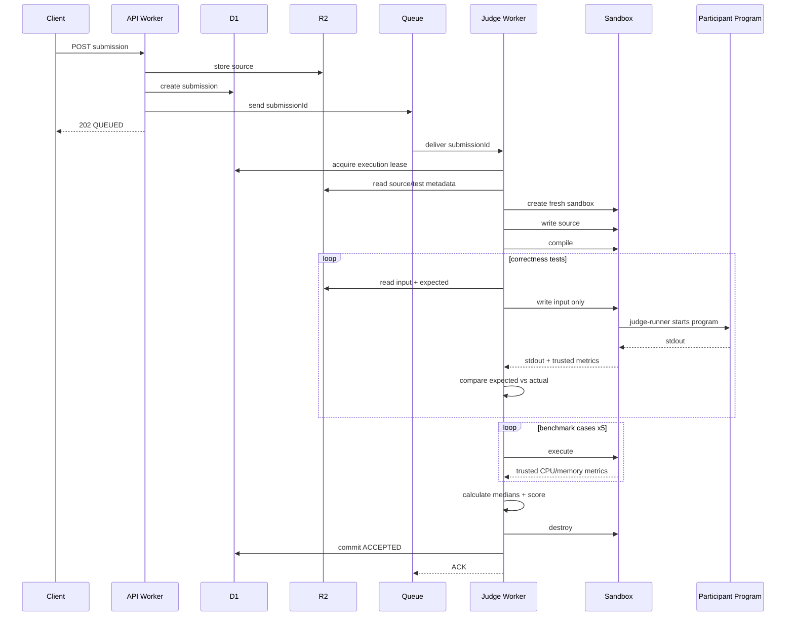
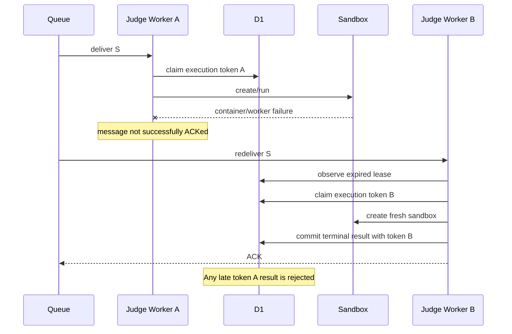

# Remote Runtime Environment — Business Logic

## 1. Purpose

This document defines the **business logic and runtime behavior** of the backend for the GDG VIT Chennai speed-coding Remote Runtime Environment.

The architecture document explains which Cloudflare components exist and how they are connected.

This document explains:

- what every backend concept means;
- what happens when a participant submits code;
- what decisions the judge makes;
- when a submission is correct;
- how efficiency is measured;
- how retries behave;
- how duplicate Queue delivery is handled;
- how contest ranking is calculated;
- how admins manage problems and hidden tests;
- what the participant is allowed to see;
- how every important edge case is classified.

The backend has no frontend dependency. Any client that can call the authenticated HTTP APIs can use the system.

---

## 2. Actors

There are three logical actors.

### 2.1 Participant

A participant writes and submits source code.

Participant can:

- view available problems;
- submit C++17 source code;
- view the status of their submissions;
- view their own compile/runtime result;
- view allowed result metrics;
- view the public leaderboard.

Participant cannot:

- read hidden expected outputs;
- directly read hidden testcase files;
- write results;
- select their own time/memory limits;
- directly create a sandbox;
- access D1;
- access R2;
- rejudge arbitrary submissions;
- create or edit problems.

---

### 2.2 Administrator / Organizer

An admin manages contest configuration.

Admin can:

- create a problem;
- create a new problem version;
- define time/memory/output limits;
- upload hidden correctness cases;
- upload benchmark cases;
- select comparator policy;
- activate a problem version;
- inspect infrastructure errors;
- request a rejudge;
- revoke participant credentials.

Admin cannot make participant code trusted.

Even admin-created judging infrastructure must continue to treat submitted code as hostile.

---

### 2.3 Judge

The Judge is trusted backend logic, not a human actor.

It:

- receives queued submissions;
- claims execution ownership;
- loads source and test configuration;
- creates the execution sandbox;
- compiles code;
- runs correctness tests;
- compares outputs;
- runs performance benchmarks;
- measures CPU/memory;
- saves results;
- retries infrastructure failures;
- destroys execution state.

Participant code does not control judge decisions.

---

## 3. Core Domain Objects

### Participant

Represents one contest participant.

Important fields:

```text
id
display_name
status
created_at
```

Possible status:

```text
ACTIVE
SUSPENDED
```

---

### API Token

Represents an API credential.

Important fields:

```text
id
participant_id
token_hash
role
revoked_at
```

Roles:

```text
PARTICIPANT
ADMIN
```

Only a token hash is persisted.

---

### Problem

Represents the logical challenge.

Important fields:

```text
id
slug
title
active_version
time_limit_ms
memory_limit_kb
output_limit_bytes
```

Problem identity remains stable while its tests/configuration can be versioned.

---

### Problem Version

Represents one immutable judging definition.

Example:

```text
problem = two-sum
version = 3
```

A version binds:

- test list
- benchmark list
- comparator behavior
- compiler/runtime policy
- limits if version-specific
- image/runner compatibility where needed

Once submissions have been judged against version 3, version 3 should not be silently modified.

Create version 4 instead.

---

### Test Case

Represents hidden input/output.

Kinds:

```text
CORRECTNESS
BENCHMARK
```

Correctness cases determine whether an answer is valid.

Benchmark cases determine relative performance only after correctness is established.

---

### Submission

Represents participant intent:

> Run this exact source code for this exact problem version.

Submission owns one authoritative public status/result.

Important fields:

```text
id
participant_id
problem_id
problem_version
language
source_r2_key
status
created_at
```

---

### Judge Attempt

Represents one infrastructure attempt to produce a result.

One submission may have more than one judge attempt because of:

- Worker preemption;
- Sandbox failure;
- R2 failure;
- D1 failure;
- administrator rejudge.

A participant submission should still have one authoritative final contest result.

---

## 4. Why Submission and Judge Attempt Are Different

Consider:

```text
Participant sends one submission S
```

Cloudflare starts judging:

```text
attempt 1
```

The Sandbox dies.

Queue retries:

```text
attempt 2
```

Attempt 2 succeeds.

Business meaning:

```text
1 participant submission
2 infrastructure attempts
1 final result
```

Without this distinction, an infrastructure retry can accidentally create duplicate scores or duplicate leaderboard entries.

---

## 5. Problem Lifecycle

Recommended problem lifecycle:

```text
DRAFT
  ↓
ACTIVE
  ↓
CLOSED
```

### DRAFT

Admin can:

- define tests;
- verify solutions;
- modify limits;
- upload benchmark cases.

Participant submission is rejected.

### ACTIVE

Participant submissions are accepted.

The active problem version is frozen for normal judging.

### CLOSED

New participant submissions are rejected.

Historical results remain readable.

---

## 6. Problem Versioning Logic

Suppose problem version 1 contains:

```text
tests A, B, C
```

Then a testcase bug is discovered.

Do not replace `B` in version 1.

Create:

```text
version 2
tests A, B2, C
```

New submissions use version 2.

Existing submissions still record version 1.

If organizers want historical submissions judged with version 2, perform an explicit rejudge.

This keeps behavior explainable.

---

## 7. Submission Request

Example:

```http
POST /api/v1/submissions
Authorization: Bearer <token>
Content-Type: application/json
```

```json
{
  "problemId": "two-sum",
  "language": "cpp17",
  "source": "#include <bits/stdc++.h>..."
}
```

The client does not send:

```text
runtime
memory
score
expected output
time limit
memory limit
container size
compiler command
```

Those are server-controlled.

---

## 8. Submission Validation

Before a submission exists, validate in this order.

### 8.1 Authentication

Reject if:

- token missing;
- token malformed;
- token hash not found;
- token revoked;
- participant suspended.

Response:

```text
401 Unauthorized
```

or:

```text
403 Forbidden
```

depending on reason/policy.

---

### 8.2 Authorization

Only a participant/admin token allowed to submit may call the endpoint.

An admin may use separate testing APIs rather than normal participant ranking.

---

### 8.3 Problem validation

Check:

- problem exists;
- problem state is `ACTIVE`;
- active version exists.

If not:

```text
404 / 409 / 422
```

depending on API convention.

---

### 8.4 Language validation

Initial accepted language:

```text
cpp17
```

Anything else:

```text
UNSUPPORTED_LANGUAGE
```

The task does not require multi-language execution.

---

### 8.5 Source validation

Check:

- source is text;
- non-empty;
- byte size within configured source limit.

Do not attempt to determine whether source is malicious.

Malicious code is expected to be handled by isolation.

---

### 8.6 Rate limit

If participant exceeds the allowed submission rate:

```text
429 Too Many Requests
```

Do not enqueue.

---

## 9. Submission Creation Transaction

After validation:

1. generate immutable submission ID;
2. determine current active problem version;
3. write source into R2;
4. create D1 submission row;
5. enqueue `submissionId`;
6. update status/timestamp as required;
7. return accepted response.

Target API response:

```http
202 Accepted
```

```json
{
  "submissionId": "sub_01J...",
  "status": "QUEUED"
}
```

The API does not wait for compile/run.

---

## 10. Source Upload Failure

If R2 source upload fails before the submission is queued:

- do not enqueue;
- do not pretend submission was accepted;
- either remove incomplete metadata or mark creation failed.

Prefer sequence:

```text
source -> R2
metadata -> D1
queue
```

with compensating cleanup if the D1 insert fails after R2 succeeds.

Or use a temporary source key and promote it logically after D1 creation.

The important invariant is:

```text
anything in Queue must have enough durable state to be reconstructed
```

---

## 11. Queue Message Meaning

Message:

```json
{
  "submissionId": "sub_01J..."
}
```

means:

> A judge should attempt to make progress on this submission.

It does **not** mean:

> This is guaranteed to be the first and only delivery.

Queue delivery is at least once.

---

## 12. Queue Consumer Start

When Judge Worker receives a message:

```text
submissionId
```

it loads the D1 submission.

Possible cases follow.

---

## 13. Submission Does Not Exist

Possible reason:

- stale/bad message;
- manual test;
- inconsistent state.

Action:

```text
log data-integrity error
ACK message
```

Retrying forever cannot create a missing submission.

---

## 14. Submission Is Already Terminal

Terminal:

```text
COMPILE_ERROR
WRONG_ANSWER
RUNTIME_ERROR
TIME_LIMIT_EXCEEDED
MEMORY_LIMIT_EXCEEDED
OUTPUT_LIMIT_EXCEEDED
ACCEPTED
JUDGE_ERROR
```

Action:

```text
ACK
do not rerun
```

This is the normal duplicate-delivery protection.

---

## 15. Submission Is QUEUED

Attempt atomic claim.

Generate:

```text
execution_token = random UUID
```

Set:

```text
RUNNING
lease_until = now + allowed attempt window
attempt_count += 1
```

If claim fails because another Worker claimed first:

```text
do not execute
ACK or safely return
```

---

## 16. Submission Is RUNNING

Compare lease.

### Lease valid

Another Worker is probably active.

Do not run a duplicate judge.

### Lease expired

Previous execution is presumed interrupted.

Current Worker may claim a new attempt.

This is how process preemption is recovered without permanently stuck submissions.

---

## 17. Execution Attempt Identity

Every attempt receives:

```text
submission_id
attempt_number
execution_token
sandbox_id
```

Example:

```text
submission_id  = sub_ABC
attempt_number = 2
execution_token = 5bb...
sandbox_id = judge-sub_ABC-attempt-2
```

The token prevents a stale old Worker from overwriting the result of a newer attempt.

Before committing a terminal result:

```text
WHERE execution_token = current token
```

must still match.

---

## 18. Load Judging Configuration

The Judge Worker loads from D1:

```text
problem_id
problem_version
time_limit_ms
memory_limit_kb
output_limit_bytes
test list
benchmark list
comparator policy
language
```

It loads from R2:

```text
source
```

This immutable configuration defines the attempt.

---

## 19. Create Sandbox

Create a fresh sandbox for the attempt.

Properties:

```text
APAC placement
fixed instance type
no public Internet
no keepAlive
finite sleepAfter fallback
```

No state from another participant is intentionally reused.

---

## 20. Initialize Sandbox Files

Worker writes only required material.

Example:

```text
/workspace/source/source.cpp
```

and later:

```text
/workspace/input/input.txt
```

Do not write:

```text
expected output
other hidden testcase inputs
database credentials
R2 credentials
participant API token
admin token
```

---

## 21. Compilation Stage

Compile once.

Example:

```text
g++ -std=c++17 -O2 -pipe source.cpp -o submission
```

Compilation has:

- fixed compiler;
- fixed flags;
- timeout;
- bounded output;
- bounded resources.

### Compile success

Continue.

### Compile failure caused by participant source

Terminal result:

```text
COMPILE_ERROR
```

Return bounded compiler output to participant.

Do not benchmark.

### Compiler infrastructure failure

If compiler itself cannot start because sandbox/runtime is broken:

```text
infrastructure retry
```

Do not classify as participant compile error.

---

## 22. Correctness Stage

For each correctness testcase, in deterministic ordinal order:

1. Judge Worker fetches input from R2.
2. Judge Worker fetches expected output from R2.
3. Only the input is copied into sandbox.
4. `judge-runner` executes participant binary.
5. runner produces trusted metrics.
6. Judge Worker reads participant stdout.
7. Judge Worker compares stdout against expected output.
8. compact result is saved.

Expected output remains trusted-side.

---

## 23. Short-Circuit Correctness

Initial implementation should stop at first fatal correctness failure.

Example:

```text
test 1 -> pass
test 2 -> pass
test 3 -> wrong answer
```

Final:

```text
WRONG_ANSWER
passed_tests = 2
```

Do not run remaining correctness tests unless contest rules require complete diagnostic coverage.

Stopping early saves compute.

---

## 24. Correctness Result Precedence

For a testcase:

### Timeout

```text
TIME_LIMIT_EXCEEDED
```

### Memory limit

```text
MEMORY_LIMIT_EXCEEDED
```

### Output limit

```text
OUTPUT_LIMIT_EXCEEDED
```

### Signal / abnormal participant termination

```text
RUNTIME_ERROR
```

### Normal exit but output mismatch

```text
WRONG_ANSWER
```

### Normal exit and output match

```text
PASS
```

The exact order matters when several conditions appear simultaneously. The trusted runner should emit one canonical termination reason.

---

## 25. Runtime Error Examples

Examples:

- segmentation fault;
- abort;
- uncaught fatal failure;
- illegal instruction;
- non-zero exit code if contest policy treats it as runtime failure.

Store:

```text
exit_code
signal
```

internally.

Participant-facing response can expose safe information without infrastructure internals.

---

## 26. Infinite Loop Business Logic

Example:

```cpp
while (true) {}
```

Runner reaches configured time limit.

Then:

1. terminate process group;
2. mark testcase `TIME_LIMIT_EXCEEDED`;
3. stop further tests;
4. destroy sandbox;
5. persist terminal submission result;
6. ACK Queue message.

This is a valid participant result, not an infrastructure retry.

---

## 27. Memory Overflow Business Logic

Example program keeps allocating memory.

Runner detects limit.

Then:

1. kill process group;
2. mark `MEMORY_LIMIT_EXCEEDED`;
3. stop correctness/benchmark work;
4. cleanup;
5. save result;
6. ACK.

No subsequent participant shares the same sandbox state.

---

## 28. Memory Leak Business Logic

A leak that remains below the test memory limit is allowed until program exit.

A leak that exceeds the configured limit becomes:

```text
MEMORY_LIMIT_EXCEEDED
```

After any submission ends:

```text
sandbox.destroy()
```

removes all remaining process/filesystem state.

The system does not attempt to "repair" leaked memory inside the process.

---

## 29. Fork Bomb / Child Process Behavior

Participant code may spawn children.

The runner treats the participant's whole process tree as one judged workload.

Rules:

- child processes count toward process limits;
- child memory counts toward submission memory as far as the supervisor can enforce;
- all child processes must be killed on timeout/cancel;
- a child may not survive the submission.

If process limit is exceeded, classify consistently as a runtime/resource-limit failure.

---

## 30. Output Flood

Example:

```cpp
while (true) {
    std::cout << "A";
}
```

If stdout/stderr reaches configured maximum:

```text
OUTPUT_LIMIT_EXCEEDED
```

Kill process group.

Do not stream unlimited output into Worker memory.

Participant-facing output is truncated/bounded.

---

## 31. Benchmark Eligibility

A submission reaches benchmarking only if:

```text
all correctness tests == PASS
```

Therefore:

```text
wrong but fast
```

cannot beat:

```text
correct but slower
```

Correctness is a prerequisite for performance ranking.

---

## 32. Benchmark Execution

Recommended initial full design:

```text
3 benchmark cases
5 runs each
```

All runs occur:

- after one compilation;
- in the same Sandbox instance;
- with the same container size;
- with the same environment;
- with no public Internet.

For each run store:

```text
CPU time
wall time
peak memory
exit status
```

A benchmark that crashes/times out means the submission is not successfully accepted under the complete judging workload.

Depending on problem design, benchmark inputs should themselves be valid correctness cases with known expected output.

---

## 33. Why Five Runs

One cloud execution can contain scheduler noise.

Five samples give enough data for a median while keeping the workload small enough for a contest backend.

Not:

```text
run once and trust exact milliseconds
```

Not:

```text
run hundreds of times
```

Five is a practical tradeoff.

---

## 34. Why Median Instead of Mean

Values:

```text
91
94
92
181
93
```

Sorted:

```text
91
92
93
94
181
```

Median:

```text
93
```

The 181 ms outlier does not dominate the score.

This is better for shared cloud execution than a simple average.

---

## 35. Primary Timing Metric

Primary metric:

```text
CPU time = user CPU + system CPU
```

Wall time is still stored.

Wall time is primarily used for:

- hard timeout;
- observing scheduling/preemption;
- debugging unusual runs.

Do not score:

```text
HTTP request duration
queue wait
container cold start
compiler time
R2 download
D1 write
```

Those measure infrastructure, not participant algorithm performance.

---

## 36. Performance Score Calculation

For each benchmark:

```text
benchmark_score =
median(run_1_cpu, ..., run_5_cpu)
```

Overall:

```text
performance_score =
sum(benchmark_score_i)
```

Example:

```text
B1 median = 102 ms
B2 median = 207 ms
B3 median = 491 ms

total = 800 ms
```

Store integer nanoseconds/microseconds internally to avoid floating-point ranking errors.

---

## 37. Memory Score

For accepted submission:

```text
peak_memory_kb =
maximum trusted peak memory observed
```

across relevant correctness/benchmark executions.

Memory is a secondary metric unless contest rules explicitly give it a weighted score.

---

## 38. Leaderboard Logic

Per problem:

1. consider only `ACCEPTED` submissions;
2. take each participant's best accepted result;
3. lower performance score ranks higher;
4. use peak memory as the next tie-breaker if desired;
5. use accepted submission timestamp as final tie-breaker.

Example:

| Participant | CPU score | Peak RAM | Accepted at |
|---|---:|---:|---|
| A | 800 ms | 28 MB | 12:01 |
| B | 800 ms | 31 MB | 11:55 |
| C | 820 ms | 20 MB | 11:40 |

A ranks above B if memory is the second tie-breaker.

---

## 39. Timing Tolerance

Exact sub-millisecond ranking differences on cloud hardware may be noise.

Optional business rule:

```text
if scores differ by < 1%
treat CPU performance as equivalent for tie-breaking
```

Then compare memory / submission time.

This is optional.

For simplicity, first implementation can rank exact stored score while documenting that repeated median CPU time is used to reduce variance.

---

## 40. Functional Determinism Contract

The backend promises:

- fixed environment for a given runner version;
- fixed tests for a given problem version;
- fixed compiler configuration;
- fixed comparator;
- fixed resource limits;
- clean sandbox;
- no public Internet;
- reproducible state from D1/R2.

The backend does **not** promise:

- identical nanosecond runtime;
- identical physical CPU;
- deterministic results for a participant program that itself uses undefined behavior or nondeterminism.

---

## 41. Submission Terminal Status Semantics

### `COMPILE_ERROR`

Source could not be compiled under the declared language/compiler policy.

### `WRONG_ANSWER`

Program completed within limits but output did not match expected output.

### `RUNTIME_ERROR`

Program terminated abnormally for participant-controlled reasons.

### `TIME_LIMIT_EXCEEDED`

Program exceeded the configured execution deadline.

### `MEMORY_LIMIT_EXCEEDED`

Program exceeded its configured memory limit.

### `OUTPUT_LIMIT_EXCEEDED`

Program generated more output than allowed.

### `ACCEPTED`

All correctness and benchmark correctness conditions passed and performance result was calculated.

### `JUDGE_ERROR`

The backend could not produce a reliable judgment after infrastructure retries.

---

## 42. Participant-Facing Result Object

Example accepted result:

```json
{
  "submissionId": "sub_123",
  "problemId": "two-sum",
  "status": "ACCEPTED",
  "passedTests": 20,
  "totalTests": 20,
  "performanceScoreMs": 800.0,
  "peakMemoryKb": 28672,
  "createdAt": "...",
  "completedAt": "..."
}
```

Wrong answer:

```json
{
  "submissionId": "sub_124",
  "status": "WRONG_ANSWER",
  "passedTests": 7,
  "totalTests": 20
}
```

Compiler error:

```json
{
  "submissionId": "sub_125",
  "status": "COMPILE_ERROR",
  "compilerOutput": "bounded compiler diagnostic"
}
```

Judge error:

```json
{
  "submissionId": "sub_126",
  "status": "JUDGE_ERROR",
  "errorId": "judge_err_..."
}
```

Do not expose infrastructure secrets.

---

## 43. Hidden Test Visibility

Participant should not receive:

```text
input bytes
expected output
hidden testcase filename that reveals answer strategy
admin notes
```

Participant may receive:

```text
failed hidden test #7
```

or simply:

```text
WRONG_ANSWER
```

depending on contest policy.

The safest default is limited information.

---

## 44. Compiler Output Visibility

Compiler diagnostics can be useful and normally safe.

Return a bounded amount, for example:

```text
first 64 KiB
```

or a smaller configured value.

Do not return arbitrary internal paths or environment values if the compiler invocation could expose them.

Use a controlled working directory.

---

## 45. Runtime stderr Visibility

Policy options:

### Strict contest

Do not return stderr.

### Developer-friendly contest

Return bounded stderr for the participant's own submission.

If returned, never mix judge infrastructure logs with participant stderr.

---

## 46. Rejudge Business Logic

Admin request:

```http
POST /api/v1/admin/submissions/:id/rejudge
```

The backend:

1. verifies admin;
2. ensures problem version/rejudge target is defined;
3. records rejudge request;
4. sets a new judge revision/attempt state;
5. publishes submission ID;
6. does not create a second participant submission;
7. retains previous attempt history;
8. updates authoritative result only when new judging completes.

If rejudge uses a new problem version, record that explicitly.

Do not silently rewrite the historical version.

---

## 47. Infrastructure Retry Rules

Retry only when outcome is not attributable to participant code.

Retryable examples:

```text
Sandbox creation service failure
container replacement before result
R2 timeout
D1 transient error
Cloudflare internal error
judge-runner infrastructure startup failure
```

Not retryable:

```text
compile error
wrong answer
program segfault
time limit
memory limit
output limit
```

---

## 48. Retry Count

Recommended:

```text
maximum infrastructure attempts = 3
```

After repeated failure:

```text
JUDGE_ERROR
```

and record message/attempt in dead-letter workflow.

Do not retry forever.

---

## 49. Stale Worker Protection

Consider:

```text
attempt 1 starts
lease expires
attempt 2 starts
attempt 1 unexpectedly returns late
```

Attempt 1 must not overwrite attempt 2.

Every terminal update must check:

```text
execution_token == current D1 execution_token
```

If token no longer matches:

```text
discard stale result
cleanup sandbox
do not change authoritative submission
```

This is essential for safe preemption recovery.

---

## 50. Sandbox Cleanup Rule

Every attempt follows:

```text
try:
    judge
finally:
    destroy sandbox
```

If the Worker disappears before `finally`, Container/Sandbox lifecycle timeout is the fallback.

A successful logical submission never depends on sandbox state surviving.

---

## 51. Correctness Test Ordering

Run tests in a stable configured `ordinal`.

Do not randomize by default.

Why:

- reproducibility;
- predictable diagnostics;
- simpler comparison between runs;
- easier debugging.

If random order is ever desired to prevent adversarial timing, the seed must be persisted so the run can be reproduced.

---

## 52. Benchmark Ordering

Keep benchmark order fixed.

All five trials for a given benchmark can be run together:

```text
B1 x5
B2 x5
B3 x5
```

or interleaved:

```text
B1 B2 B3
B1 B2 B3
...
```

Interleaving may distribute gradual host effects but complicates implementation.

Initial version should choose the simpler fixed method and document it.

---

## 53. Warm-Up Consideration

C++ native binaries usually need less JIT warm-up than Java/JavaScript.

Still, first-run cache/page effects can differ.

Options:

1. keep all five runs and use median;
2. run one non-scored warm-up, then five scored runs.

Initial C++ implementation can use five scored runs with median.

If additional languages with JIT compilation are added, warm-up policy must become language-specific.

---

## 54. Randomness and Time

The backend should not provide Internet randomness.

However participant C++ can still call:

```text
std::random_device
system clock
```

If a submission intentionally changes output based on nondeterministic data, repeatability is not guaranteed.

Contest problems should be designed so correct solutions do not require external randomness/time.

A stronger future runner can restrict some system interfaces, but this is not required for the first core.

---

## 55. Environment Variables

Participant process receives a minimal explicit environment.

For example:

```text
LANG=C.UTF-8
LC_ALL=C.UTF-8
TZ=UTC
PATH=<minimal fixed path>
```

Do not inherit Worker or infrastructure secrets.

---

## 56. File Access

Participant gets only required workspace files.

Do not provide all testcases at once.

For each test:

```text
replace /workspace/input/input.txt
run
collect
remove/reset
```

The binary can remain from compilation.

Judge-owned metrics directory is not writable by participant.

---

## 57. Network Behavior

No public Internet.

A participant attempt to:

```text
curl example.com
```

should fail.

This is not a judge error.

It is simply an unavailable capability of the execution environment.

If participant program subsequently fails because it depends on networking, that is participant behavior.

---

## 58. Source Privacy

Participant source is stored in R2.

Participant can read their own source if an API endpoint is provided.

Public leaderboard should not automatically expose source.

Admin access can inspect source for debugging/moderation if contest rules permit.

---

## 59. API Authorization Matrix

| Operation | Participant | Admin |
|---|:---:|:---:|
| List active problems | Yes | Yes |
| Read own submission | Yes | Yes |
| Read other participant private submission | No | Yes if policy allows |
| Submit solution | Yes | Optional |
| View leaderboard | Yes | Yes |
| Create problem | No | Yes |
| Upload hidden tests | No | Yes |
| Change limits | No | Yes |
| Rejudge | No | Yes |
| Inspect judge errors | No | Yes |
| Read hidden expected output | No | Yes |

---

## 60. Health API

Example:

```text
GET /api/v1/health
```

Should not run participant code.

Can return:

```json
{
  "status": "ok"
}
```

Optional deeper admin-only health may check:

- D1 connectivity;
- R2 connectivity;
- Queue ability to send a synthetic non-judge message;
- recent judge success rate.

Avoid expensive health checks on every public request.

---

## 61. Submission List

Participant:

```text
GET /api/v1/submissions
```

must automatically filter by authenticated participant ID.

Never trust:

```text
?participantId=someone_else
```

to control access.

Admin can have a separate filtered endpoint.

---

## 62. Leaderboard Best-Submission Rule

A participant may submit many accepted solutions.

Leaderboard should not create a row for every accepted submission.

Use:

```text
best accepted submission per participant per problem
```

"Best" is determined by contest ranking tuple.

For example:

```text
(performance_score_ns, peak_memory_kb, completed_at)
```

lowest tuple wins.

---

## 63. Contest-Wide Scoring Extension

If multiple problems exist, a contest-wide score can aggregate:

```text
number of solved problems
performance points
penalties
```

But the supplied Task 2 only requires comparing algorithmic efficiency. The initial system can provide per-problem leaderboards without inventing a complex ICPC-style penalty model.

---

## 64. Submission Rate Limit Logic

Example simple rule:

```text
max 5 submissions / 10 seconds
```

Reasons:

- accidental submit loops;
- malicious queue flood;
- contest fairness;
- cost control.

A rejected rate-limited request is not stored as a normal judged submission.

---

## 65. Submission Size Limit

Example:

```text
128 KiB source maximum
```

The exact value can be configured.

Reason:

- algorithmic code is small;
- large source bodies waste storage/CPU;
- avoids abuse.

This application-level limit is intentionally much smaller than Cloudflare's maximum HTTP request body.

---

## 66. Problem Limit Ownership

Only admins define:

```text
time_limit_ms
memory_limit_kb
output_limit_bytes
```

The participant cannot submit:

```json
{
  "timeLimit": 600000
}
```

and override it.

The Judge loads limits from trusted problem configuration.

---

## 67. Compile Limit Ownership

Compilation has separate global/language limits.

Example:

```text
compile wall limit = 10 s
compile output limit = 256 KiB
```

Problem runtime limit does not necessarily equal compiler limit.

Pathological C++ templates can consume significant compiler resources, so compilation must be bounded independently.

---

## 68. Queue Backpressure Business Meaning

Suppose:

```text
500 participants submit simultaneously
```

Business response:

```text
all valid submissions are accepted into durable queue
only 10 execute simultaneously
remaining submissions show QUEUED
```

The platform does not reject a submission only because all judge slots are currently occupied.

This preserves fairness while controlling cost.

---

## 69. Queue Wait Time Is Not Score

Participant A:

```text
queued for 30 s
CPU score = 500 ms
```

Participant B:

```text
queued for 1 s
CPU score = 510 ms
```

A still has the better performance score.

Queue delay is operational latency only.

---

## 70. Container Cold Start Is Not Score

Same rule.

Do not measure:

```text
queue receive -> result
```

as algorithm performance.

Only trusted participant process metrics count.

---

## 71. Compiler Time Is Not Algorithm Score

Compilation is a prerequisite.

A template-heavy submission may compile slower but run faster.

The contest judges runtime efficiency unless problem rules explicitly say compilation efficiency matters.

Store compile time for operations/debugging, not ranking.

---

## 72. Transaction / Consistency Invariants

The backend should maintain these invariants.

### Invariant A

A Queue job must reference a durable submission record.

### Invariant B

A terminal submission must have no active execution lease.

### Invariant C

Only the current execution token may commit the authoritative result.

### Invariant D

Participant cannot write result metrics.

### Invariant E

Benchmark score exists only for a submission that passed correctness.

### Invariant F

Submission result is tied to a specific problem version.

### Invariant G

Expected outputs never enter participant-readable storage.

### Invariant H

A participant source executes only inside Sandbox/Container.

---

## 73. Result Commit

At end of successful attempt, use conditional update:

```sql
UPDATE submissions
SET
    status = ?,
    passed_tests = ?,
    total_tests = ?,
    performance_score_ns = ?,
    peak_memory_kb = ?,
    completed_at = CURRENT_TIMESTAMP,
    updated_at = CURRENT_TIMESTAMP,
    execution_token = NULL,
    lease_until = NULL
WHERE id = ?
  AND execution_token = ?;
```

If affected rows = 0:

```text
attempt became stale
do not overwrite newer result
```

---

## 74. Intermediate Result Persistence

Options:

### Minimal

Store per-test results only after stage completion.

### More recoverable

Persist each completed testcase/benchmark run.

If Worker is interrupted, a new attempt could theoretically resume.

However exact resume can complicate determinism because the new attempt may run on a different Container.

For the first version:

```text
retry full judging attempt from compilation
```

is simpler and more reproducible.

Persist per-test details for diagnostics, but do not attempt partial resume.

---

## 75. Repeating the Entire Attempt After Infrastructure Failure

Why restart?

Suppose:

```text
B1 runs on Container X
container dies
B2 would run on Container Y
```

Combining those into one score makes the benchmark environment less consistent.

Better:

```text
attempt invalid
restart correctness/benchmark on new Sandbox
```

Because source/test definitions are durable in R2/D1, rebuilding is safe.

---

## 76. Judge Error Visibility

Participant receives:

```text
JUDGE_ERROR
```

and possibly:

```text
errorId
```

Admin can see:

```text
attempt
Cloudflare/Sandbox error classification
stack/correlation
timestamps
```

Participants should not see secrets or internal bindings.

---

## 77. Dead-Letter Handling

If a message reaches DLQ:

1. preserve submission/attempt history;
2. mark or reconcile submission as `JUDGE_ERROR`;
3. alert/log for admin;
4. allow admin rejudge later.

DLQ must not create an invisible stuck submission.

---

## 78. Admin Problem Creation

Suggested sequence:

1. `POST /admin/problems`
2. create version 1 in `DRAFT`
3. upload hidden cases to R2
4. create testcase metadata in D1
5. run known reference submissions manually/test endpoint
6. validate limits
7. activate version
8. problem becomes participant-visible

Do not activate partially uploaded test configuration.

---

## 79. Hidden Test Upload

For every case admin defines:

```text
kind
ordinal
input file
expected file
comparator
optional weight
```

Backend generates server-owned R2 keys.

Do not let participant-supplied filenames directly become unrestricted R2 paths.

---

## 80. Test Integrity

Optional but useful:

Store SHA-256 for input/output artifacts.

Example:

```text
input_sha256
expected_sha256
```

Purpose:

- detect accidental modification;
- improve reproducibility;
- document exact judged artifacts.

---

## 81. Runner Versioning

Every submission result should record:

```text
compiler_version
compiler_flags
runner_image_version
judge_runner_version
```

If judge behavior changes materially:

```text
runner v1 -> runner v2
```

old and new results can be distinguished.

A contest-wide rejudge may be necessary if the scoring semantics change.

---

## 82. Comparator Versioning

Output comparison rules are part of judging.

If comparator logic changes, record a comparator version or bind it through the problem version.

Otherwise an old submission could become correct/incorrect without a visible configuration change.

---

## 83. Deterministic Locale

Set:

```text
LANG=C.UTF-8
LC_ALL=C.UTF-8
TZ=UTC
```

This reduces differences in:

- formatting;
- locale-sensitive library behavior;
- timezone-sensitive behavior.

Contest solutions should not depend on host locale.

---

## 84. No Arbitrary Dependency Installation

Initial C++17 runtime uses:

```text
standard library
preinstalled fixed toolchain
```

Do not allow:

```text
apt install
curl dependency
git clone library
```

during submission execution.

Reasons:

- Internet disabled;
- security;
- speed;
- reproducibility.

If libraries are later supported, bake approved versions into the runner image.

---

## 85. Participant Program Exit Code Policy

Recommended:

```text
exit 0 -> eligible for output comparison
nonzero -> RUNTIME_ERROR
signal -> RUNTIME_ERROR
```

Special runner termination codes map to:

```text
TLE
MLE
OLE
```

before generic runtime error.

---

## 86. Stdout and Stderr Semantics

`stdout`:

```text
program answer
```

`stderr`:

```text
diagnostic only
```

Comparator reads only stdout.

Participant cannot print the answer to stderr and pass.

---

## 87. Floating-Point Problems

If a problem expects floating-point answers, exact string comparison may be inappropriate.

Comparator can define:

```text
absolute_error <= eps
or
relative_error <= eps
```

This is problem-specific and must be trusted-side.

Initial implementation may avoid floating-point problems if custom checking is out of scope.

---

## 88. Custom Checker Extension

Future:

```text
expected output + participant output + input
        │
        ▼
trusted custom checker
```

The checker itself must run as trusted code or in a separate tightly controlled checker environment.

Not required initially.

---

## 89. Security vs Contest Feedback

More error information is convenient, but hidden data matters.

Recommended participant output:

| Result | Safe feedback |
|---|---|
| CE | bounded compiler output |
| WA | failed hidden testcase number or generic WA |
| RE | exit/signal category, bounded stderr optionally |
| TLE | time limit |
| MLE | memory limit |
| OLE | output limit |
| Accepted | score + memory |
| Judge Error | correlation ID |

Never return expected hidden output.

---

## 90. Cancellation Extension

An admin may later cancel a stuck/rejudge attempt.

Business logic:

```text
mark cancellation intent
invalidate execution token / lease
kill process if handle is available
destroy sandbox
```

A late Worker must fail the token check and cannot commit.

Not required in minimal version.

---

## 91. Submission Deletion

For contest integrity, normal participants should not hard-delete judged submissions.

Possible:

```text
participant can hide from own UI
```

but historical submission records remain for audit.

Admin hard deletion can be an operational action if privacy policy requires it.

---

## 92. R2 Cleanup

If a submission is intentionally purged:

- remove source R2 object;
- remove optional logs;
- retain or remove D1 metadata according to contest/privacy policy.

Hidden problem tests are version-owned and not deleted when a participant submission is removed.

---

## 93. Data Retention

Define later based on event requirements.

Possible:

```text
submissions/results: event + audit period
compiler/stderr artifacts: shorter period
hidden tests: retained with problem versions
tokens: revoke after event
```

Retention is not required by Task 2 but should be documented if implemented.

---

## 94. Administrative Audit

Useful records:

- problem version activation;
- testcase update/version creation;
- rejudge;
- token revocation;
- judge error.

This prevents silent contest-result changes.

A lightweight audit table is optional but valuable.

---

## 95. Minimum Working Core

The system is considered functionally complete for the submission if it demonstrates:

1. authenticated participant code submission;
2. C++17 compilation;
3. queue-based asynchronous execution;
4. isolated fresh Sandbox;
5. no public Internet;
6. correct answer detection;
7. compiler error;
8. runtime error;
9. infinite-loop timeout;
10. memory overflow handling;
11. output limit handling;
12. trusted timing/memory metrics;
13. repeated benchmark median;
14. D1 persisted result;
15. idempotent duplicate Queue handling;
16. infrastructure retry path;
17. leaderboard API;
18. easy reproducible deployment.

---

## 96. Recommended Demo Cases

The demonstration should intentionally show failures, not only the happy path.

### Demo 1 — Accepted

Correct C++17 solution.

Show:

```text
QUEUED -> RUNNING -> ACCEPTED
```

and CPU/memory score.

### Demo 2 — Compile error

Missing semicolon.

Show:

```text
COMPILE_ERROR
```

### Demo 3 — Wrong answer

Hard-coded incorrect output.

Show:

```text
WRONG_ANSWER
```

### Demo 4 — Infinite loop

```cpp
while (true) {}
```

Show:

```text
TIME_LIMIT_EXCEEDED
```

and then show another submission still runs normally.

### Demo 5 — Memory overflow

Large repeated allocation.

Show:

```text
MEMORY_LIMIT_EXCEEDED
```

### Demo 6 — Output flood

Infinite print.

Show:

```text
OUTPUT_LIMIT_EXCEEDED
```

### Demo 7 — Queue/backpressure

Submit more jobs than concurrency cap.

Show:

```text
10 running
remaining queued
```

if practical.

---

## 97. Business Logic Sequence — Accepted Submission



---

## 98. Business Logic Sequence — Infrastructure Failure



---

## 99. Business Logic Sequence — Duplicate Delivery After Success

```text
Worker A
  │
  ├── executes
  ├── writes ACCEPTED to D1
  X dies before ACK

Queue redelivers
  │
  ▼
Worker B
  │
  ├── reads D1
  ├── sees ACCEPTED
  └── ACK only
```

No second score is created.

---

## 100. Final Business Rules

The system should enforce these rules consistently:

1. Participant code is always untrusted.
2. Only trusted Workers write authoritative results.
3. Only trusted Workers access expected outputs.
4. Every submission is tied to an immutable problem version.
5. Every Queue message is treated as potentially duplicated.
6. One submission has one authoritative contest result.
7. Infrastructure retries do not create duplicate leaderboard entries.
8. Only the current execution token can commit.
9. Every attempt uses a fresh disposable sandbox.
10. Sandboxes receive no D1/R2 credentials.
11. Public Internet is disabled.
12. Compilation happens once per attempt.
13. Correctness is evaluated before performance.
14. Incorrect submissions do not enter efficiency ranking.
15. Participant process CPU time is the primary timing metric.
16. Wall time is used to enforce hard timeout.
17. Benchmarks are repeated five times.
18. Median is used instead of arithmetic mean.
19. Benchmark repetitions remain in the same sandbox when the attempt is healthy.
20. Sandbox/Worker failure invalidates the affected attempt rather than mixing measurements across environments.
21. Peak memory is trusted-runner data.
22. Queue delay, cold start, compilation, R2, and D1 time never affect participant score.
23. Participant failures are terminal valid results.
24. Infrastructure failures are retried.
25. Retries are bounded.
26. Repeated infrastructure failure becomes `JUDGE_ERROR`.
27. Results and historical judge attempts remain auditable.
28. Queue backlog is preferred over uncontrolled Container autoscaling.
29. Ten simultaneous executions is the initial deliberate concurrency policy.
30. The system optimizes for a well-designed, secure, reproducible working core rather than feature count.

---

## 101. Cloudflare-Specific Assumptions Used by This Logic

This business logic depends on the following current Cloudflare platform behavior:

- Queues uses at-least-once delivery, requiring idempotency.
- Queue consumers support an explicit concurrency cap.
- Queue consumer invocations have a finite wall-clock duration.
- Sandbox SDK uses Cloudflare Containers and Durable Objects under the hood.
- Sandboxes/Containers are ephemeral execution environments.
- Sandbox lifecycle supports explicit destruction.
- Public outbound Internet can be disabled.
- Sandbox 1.0 preview exposes supervised process handles, process kill, and remote lifetime timeout.
- Container placement can be constrained to APAC.
- D1 is suitable for compact indexed relational state but a single database processes queries serially.
- R2 is appropriate for source/test file objects.

Cloudflare limits and preview APIs should be verified again before final deployment.

References:

- https://developers.cloudflare.com/sandbox/
- https://developers.cloudflare.com/sandbox/1-0-preview/
- https://developers.cloudflare.com/sandbox/1-0-preview/processes/
- https://developers.cloudflare.com/sandbox/guides/outbound-traffic/
- https://developers.cloudflare.com/containers/platform-details/placement/
- https://developers.cloudflare.com/containers/platform-details/limits/
- https://developers.cloudflare.com/queues/reference/delivery-guarantees/
- https://developers.cloudflare.com/queues/configuration/consumer-concurrency/
- https://developers.cloudflare.com/queues/platform/limits/
- https://developers.cloudflare.com/d1/platform/limits/
- https://developers.cloudflare.com/d1/best-practices/use-indexes/
